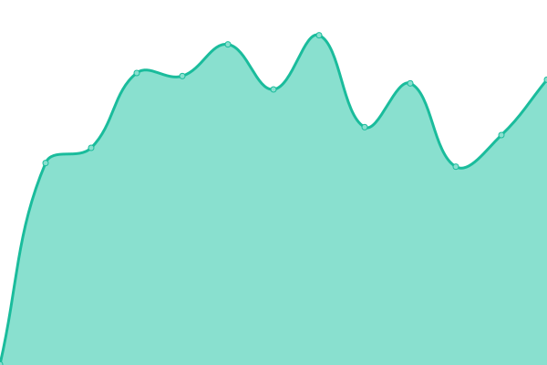

# [📈 Live Status](https://demo.upptime.js.org): <!--live status--> **🟥 Complete outage**

> **🔧 Scheduled Maintenance:** To set up scheduled maintenance for monitored services, see [QUICKSTART.md](./QUICKSTART.md) for immediate instructions or [SCHEDULED_MAINTENANCE_README.md](./SCHEDULED_MAINTENANCE_README.md) for detailed documentation.

This repository contains the open-source uptime monitor and status page for [Mnazz](https://mnazz.com), powered by [Upptime](https://github.com/upptime/upptime).

With [Upptime](https://upptime.js.org), you can get your own unlimited and free uptime monitor and status page, powered entirely by a GitHub repository. We use [Issues](https://github.com/DevMnazz/mnazz-status/issues) as incident reports, [Actions](https://github.com/DevMnazz/mnazz-status/actions) as uptime monitors, and [Pages](https://demo.upptime.js.org) for the status page.

<!--start: status pages-->
<!-- This summary is generated by Upptime (https://github.com/upptime/upptime) -->
<!-- Do not edit this manually, your changes will be overwritten -->
<!-- prettier-ignore -->
| URL | Status | History | Response Time | Uptime |
| --- | ------ | ------- | ------------- | ------ |
|  [Mnazz Website](https://mnazz.com) | 🟥 Down | [mnazz-website.yml](https://github.com/DevMnazz/mnazz-status/commits/HEAD/history/mnazz-website.yml) | 

 310ms
     
 | 

<a href="https://status.mnazz.com/history/mnazz-website">39.92%</a>
    

|  [Mnazz Panel](https://panel.mnazz.com) | 🟥 Down | [mnazz-panel.yml](https://github.com/DevMnazz/mnazz-status/commits/HEAD/history/mnazz-panel.yml) | 

 428ms
     
 | 

<a href="https://status.mnazz.com/history/mnazz-panel">45.94%</a>
    

|  [MnazzMC Wiki](https://mc.mnazz.com) | 🟥 Down | [mnazz-mc-wiki.yml](https://github.com/DevMnazz/mnazz-status/commits/HEAD/history/mnazz-mc-wiki.yml) | 

 439ms
     
 | 

<a href="https://status.mnazz.com/history/mnazz-mc-wiki">45.96%</a>
    

<!--end: status pages-->

[**Visit our status website →**](https://demo.upptime.js.org)

## 📄 License

- Powered by: [Upptime](https://github.com/upptime/upptime)
- Code: [MIT](./LICENSE) © [Anand Chowdhary](https://anandchowdhary.com), supported by [Pabio](https://pabio.com)
- Data in the `./history` directory: [Open Database License](https://opendatacommons.org/licenses/odbl/1-0/)
